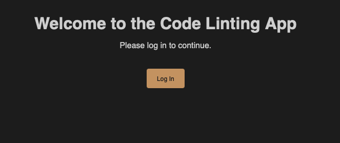
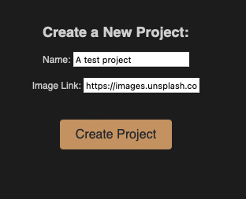
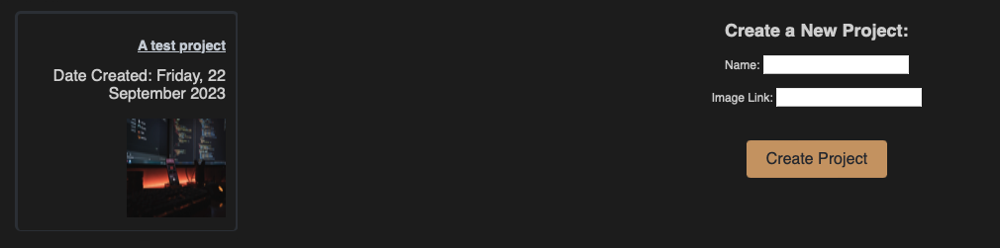
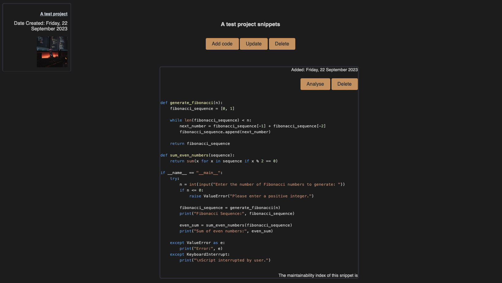

# Code linter app
This web app allows the user to create projects and upload code belonging to those projects. They can then analyse the quality of their code. Currently, the only metric reported on is Maintainability Index.

Stack used:
- Python3 (3.10.9) with Flask and PostgreSQL for the backend
- Vanilla JavaScript, HTML, and CSS for the frontend
- Auth0 with JWTs for authentication 
- Postman for testing
- Heroku for deployment

## Project overview
### Purpose
The purpose of the project is to analyse code (Python only). The `radon` library is used for the analysis. Metrics available include Maintainability Index, Cyclomatic Complexity, and Halstead metrics. 

### Data model
The two main entities are projects and snippets. Projects are a unit for organising snippets: you can add as many snippets as you like. 

### RBAC
There are also two roles implemented: Project Owner (PO) and Developer. A Project Owner has full access to every possible permission:

- Viewing each page
- CRUD on every project
- CRUD on every snippet

By contrast, a Developer can view every page, but cannot create or delete new projects.

Public access is only for viewing available projects (this is harmless information) but not snippets.

## Demo
The app is currently deployed to Heroku, but can also be run locally. 

If we navigate to `https://vestbroyek-code-linter-c714a9027c69.herokuapp.com`, we will be greeted by a login screen. 



I will log in with Auth0 as a Project Owner and be redirected to the `/projects` endpoint. Here, I can create a new project. 



When we click Create, we will see a new project appearing in the sidebar:



Clicking into it, we can add code, update (change the project name or image), or delete the project. We'll add an example Python script. Refreshing the page, we can now see the snippet appearing. It is highlighted in VSCode style, and you can analyse or delete it:



Clicking the analyse button will tell you the maintainability index or the code. In future, I would look to implement more metrics and specific suggestions.

## How to use
### On Heroku 
Go to `https://vestbroyek-code-linter-c714a9027c69.herokuapp.com/projects` and add the query parameter `access_token` in the format 

```
https://vestbroyek-code-linter-c714a9027c69.herokuapp.com/projects#access_token=abc123&expires_in=86400&token_type=Bearer
```

### Locally
- Clone this repo 
- Create a new virtual environment
- From `code_linter_app`, install requirements: `pip3 install -r requirements.txt`
- Create a local database, e.g. with Docker:
    - docker run -p 5432:5432 -e POSTGRES_PASSWORD=postgres -e POSTGRES_DB=linter --rm postgres
    - the DB name will be `linter`, the username `postgres`, and the password `postgres`
    - to avoid removing the database, get rid of the `--rm` flag
    - run migrations with `flask db upgrade`
- Run `export FLASK_APP=app.py` and run `flask run --debug --reload` to run the API!

### Testing
To run tests, simply import the Postman collection. In the collection variables, set a project owner and developer token.

## API reference
### GET /projects
- **Functionality:** Retrieve the list of projects.
- **Required Scopes:** `get:projects`
- **Raises:**
  - 404 Not Found: If no projects are found.

### GET /projects/{project_id}
- **Functionality:** Retrieve details of a specific project.
- **Required Scopes:** `get:projects`
- **Raises:**
  - 404 Not Found: If the specified project does not exist.

### POST /projects
- **Functionality:** Create a new project.
- **Required Scopes:** `post:projects`
- **Raises:**
  - 400 Bad Request: If the request data is incomplete or malformed.
  - 500 Server Error: If there is an issue while creating the project.

### POST /projects/{project_id}/snippets
- **Functionality:** Create a new snippet for a project.
- **Required Scopes:** `post:snippets`
- **Raises:**
  - 400 Bad Request: If the request data is incomplete or malformed.
  - 500 Server Error: If there is an issue while creating the snippet.

### GET /analyse/{snippet_id}
- **Functionality:** Analyze a snippet.
- **Required Scopes:** `analyse:snippets`
- **Raises:**
  - 404 Not Found: If the specified snippet does not exist.
  - 500 Server Error: If there is an issue while analyzing the snippet.

### PATCH /projects/{project_id}
- **Functionality:** Update project details.
- **Required Scopes:** `patch:projects`
- **Raises:**
  - 404 Not Found: If the specified project does not exist.
  - 422 Unprocessable Entity: If there is an issue with the request data.
  - 500 Server Error: If there is an issue while updating the project.

### DELETE /projects/{project_id}
- **Functionality:** Delete a project.
- **Required Scopes:** `delete:projects`
- **Raises:**
  - 404 Not Found: If the specified project does not exist.
  - 500 Server Error: If there is an issue while deleting the project.

### DELETE /snippets/{snippet_id}
- **Functionality:** Delete a snippet.
- **Required Scopes:** `delete:snippets`
- **Raises:**
  - 404 Not Found: If the specified snippet does not exist.
  - 500 Server Error: If there is an issue while deleting the snippet.

### Errors

Errors are returned as JSON objects in the following format:

```json
{
    "success": false,
    "error": 400,
    "message": "Bad request"
}
```